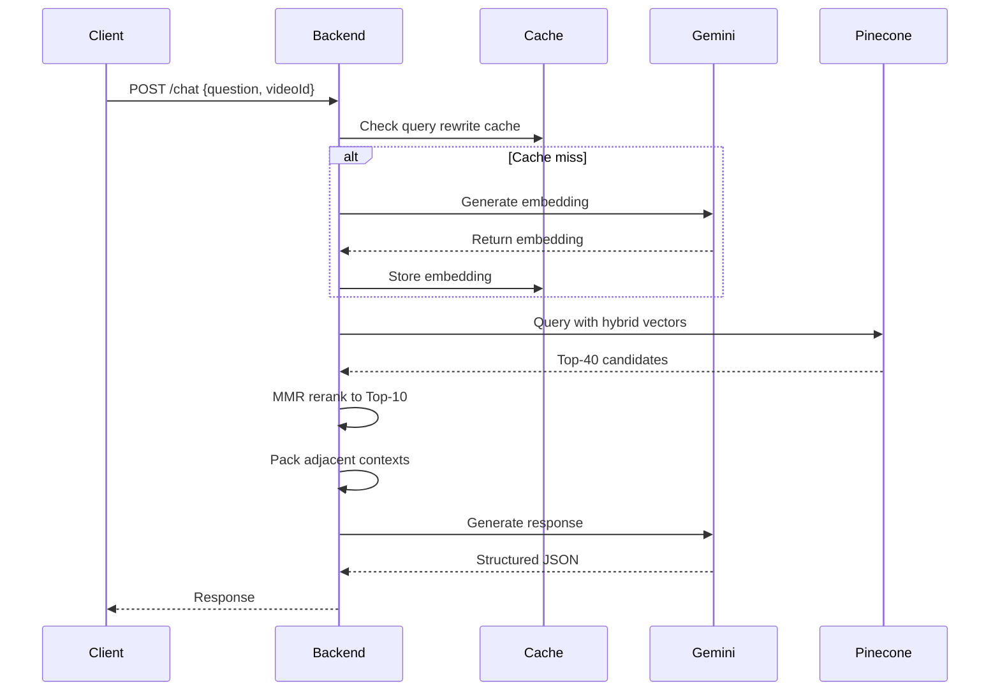
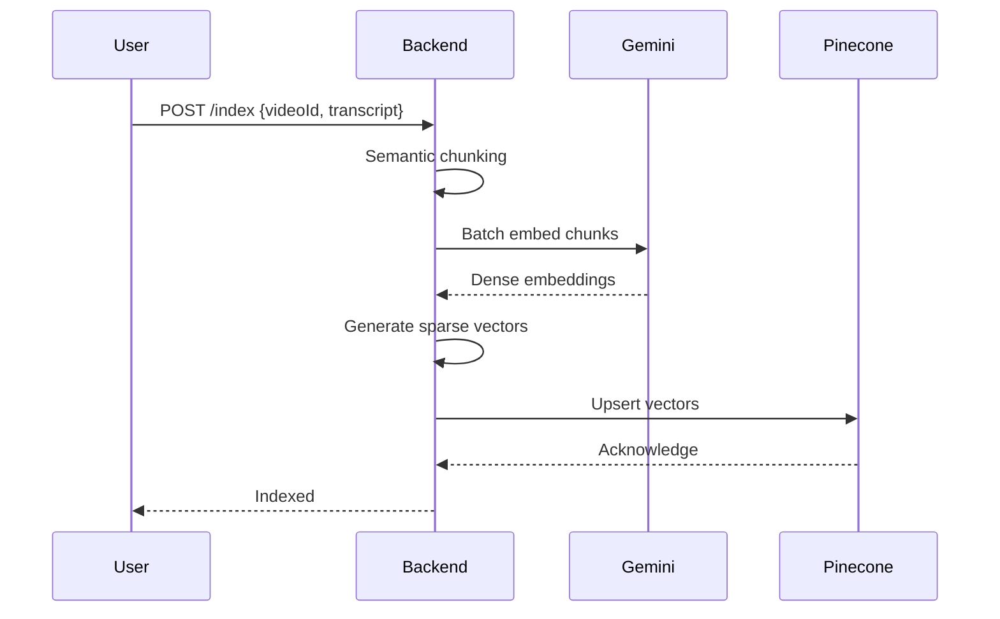
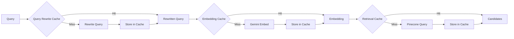
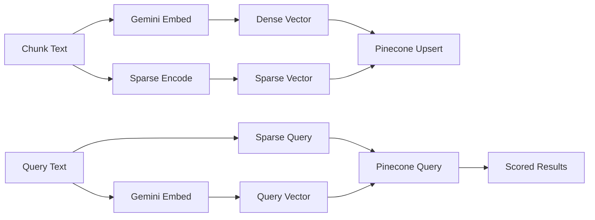
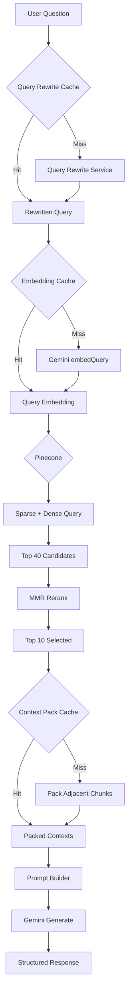
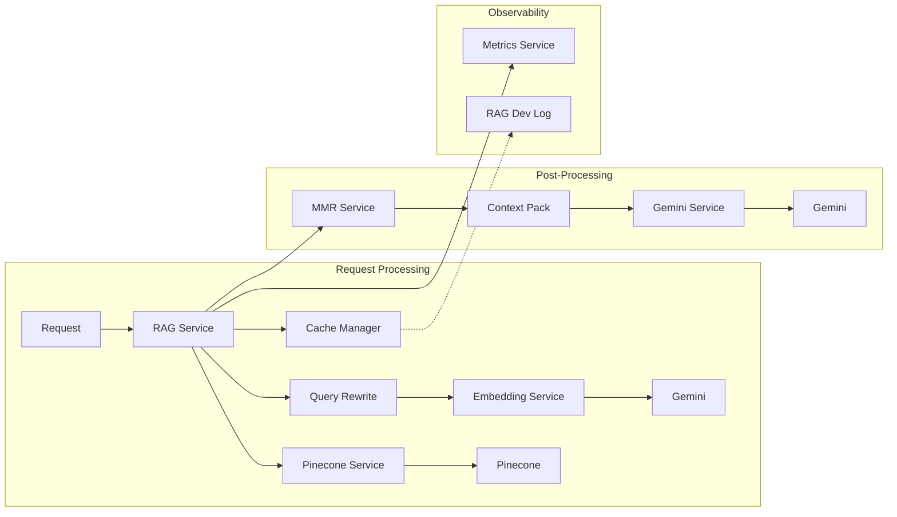
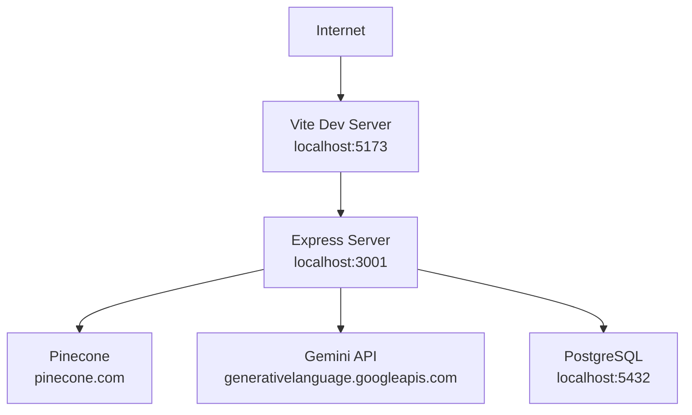

# YT StudyFlow System Design

High-level and low-level design documentation with sequence diagrams.

---

## High-Level Design

### System Components

```
┌─────────────────────────────────────────────────────────────────────┐
│                        YT StudyFlow System                           │
├─────────────────────────────────────────────────────────────────────┤
│                                                                      │
│  ┌──────────────┐    ┌──────────────┐    ┌─────────────────────┐ │
│  │  Frontend    │    │   Backend    │    │   External APIs     │ │
│  │  (Browser)   │◀──▶│  (Express)   │◀──▶│  ┌──────────────┐   │ │
│  └──────────────┘    └──────────────┘    │  │  Pinecone    │   │ │
│         │                   │           │  └──────────────┘   │ │
│         │                   │           │  ┌──────────────┐   │ │
│         ▼                   ▼           │  │  Gemini API  │   │ │
│  ┌──────────────┐    ┌──────────────┐    │  └──────────────┘   │ │
│  │  Vite Dev    │    │  Routes      │    │  ┌──────────────┐   │ │
│  │  Server      │    │  Controllers │    │  │  YouTube API │   │ │
│  └──────────────┘    └──────────────┘    │  └──────────────┘   │ │
│         │                   │           └─────────────────────┘ │
│         │                   │                                  │
│         │                   ▼                                  │
│         │            ┌──────────────┐                         │
│         │            │  RAG Service  │                         │
│         │            │              │                         │
│         │            │  Cache       │                         │
│         │            │  Query Rewrite│                        │
│         │            │  Embedding    │                         │
│         │            │  Retrieval    │                         │
│         │            │  MMR         │                         │
│         │            │  Packing      │                         │
│         │            └──────────────┘                         │
│         │                   │                                  │
│         │                   ▼                                  │
│         │            ┌──────────────┐                         │
│         │            │  PostgreSQL  │                         │
│         │            │  (Prisma)    │                         │
│         │            └──────────────┘                         │
│         │                                                      │
└─────────┴────────────────────────────────────────────────────────┘
```

---

## Low-Level Design

### Component Details

#### Backend Services

- **RAG Service**: Orchestrates retrieval pipeline
- **Embedding Service**: Gemini integration for dense vectors
- **Pinecone Service**: Vector storage and querying
- **Cache Manager**: Four-tier LRU caching
- **Query Rewrite Service**: Rule-based query transformation
- **MMR Service**: Maximal Marginal Relevance reranking
- **Context Packing Service**: Adjacent chunk merging

#### Data Flow

Each request follows this path:
1. Validate request parameters
2. Check deduplication cache
3. Rewrite query if needed
4. Generate/fetch embedding
5. Query Pinecone
6. Apply MMR reranking
7. Pack contexts
8. Build prompt
9. Generate response
10. Log metrics

---

## Sequence Diagrams

### Request Lifecycle



### Video Indexing Pipeline



### Caching Flow



### Vector Database Flow



---

## Backend Architecture

### Route Structure

```
src/routes/
├── chat.ts           # /chat endpoint
├── video.ts          # Video management
├── index.ts          # Route aggregation
└── health.ts       # Health checks
```

### Service Layer

```
src/services/
├── rag.service.ts         # Core orchestration
├── embedding.service.ts   # Gemini embedding wrapper
├── pinecone.service.ts    # Vector DB client
├── mmr.service.ts         # Reranking algorithm
├── contextPacking.service.ts # Context merging
├── queryRewrite.service.ts # Query transformation
├── promptBuilder.service.ts # Prompt construction
├── gemini/               # Gemini HTTP integration
└── metrics.service.ts    # Observability
```

### Caching Layer

```
src/cache/
├── lruCache.ts      # O(1) cache implementation
├── cacheKeys.ts     # Key generation utilities
└── cacheManager.ts  # Cache orchestration
```

### Performance Layer

```
src/performance/
├── requestDeduplicator.ts # Concurrency dedup
├── asyncUtils.ts        # Parallel helpers
└── performanceConfig.ts   # Configuration
```

### Reliability Layer

```
src/reliability/
├── errors.ts      # Error types
├── timeout.ts     # Request timeouts
├── retry.ts       # Retry logic
└── healthCheck.ts # Health monitoring
```

---

## Frontend Architecture

### Component Structure

```
src/
├── components/
│   ├── ChatView.tsx       # Main chat interface
│   ├── MessageList.tsx    # Message display
│   └── SourceList.tsx     # Citation display
├── lib/
│   └── api.ts             # API client
└── routes/
    ├── Root.tsx           # Main route
    └── Video.tsx          # Video processing
```

---

## Retrieval Pipeline

### Detailed Flow



### Component Interactions



---

## Deployment Diagram



### Production Deployment

```
┌─────────────────────────────────────────────────────────────┐
│                    Load Balancer (Optional)                  │
└─────────────────────────────────────────────────────────────┘
                              │
        ┌─────────────────────┼─────────────────────┐
        │                     │                     │
        ▼                     ▼                     ▼
┌──────────────┐    ┌──────────────┐    ┌──────────────┐
│  Frontend    │    │   Backend    │    │   Backend    │
│  (Static)    │    │  (Instance 1)│    │  (Instance 2)│
└──────────────┘    └──────────────┘    └──────────────┘
                              │
                    ┌─────────┴─────────┐
                    │   Pinecone        │
                    │   (Managed)       │
                    └─────────┬─────────┘
                              │
                    ┌─────────┴─────────┐
                    │   PostgreSQL      │
                    │   (Managed)       │
                    └───────────────────┘
```

---

## Scaling Strategy

### Vertical Scaling

- Increase Node.js heap for large video processing
- Larger Pinecone pod for higher QPS
- Connection pooling for Gemini API

### Horizontal Scaling

Current limitations:
- In-memory cache not shared
- No request routing
- Single PostgreSQL instance

To scale horizontally:
1. Add Redis for shared caching
2. Add load balancer
3. Separate worker process for indexing
4. Database read replicas

### Scaling Recommendations

| Metric | Current | Scale Trigger | Action |
|--------|---------|---------------|--------|
| QPS | <10 | >100 QPS | Add instances + Redis |
| Video length | <60min | >2hr | Async processing |
| Cache hit rate | >50% | <30% | Increase cache size |
| Response time | <3s | >5s | Optimize pipeline |